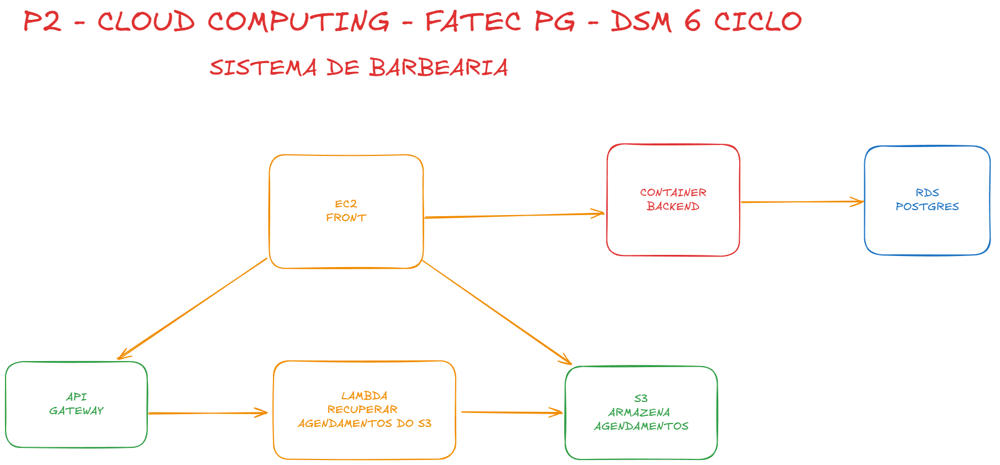

# P2Cloud - Sistema de Agendamento para Barbearias

Sistema completo de agendamento de serviços para barbearias desenvolvido com arquitetura de microsserviços, utilizando containers Docker separados e infraestrutura como código (IaC) com Terraform na AWS.

## 📋 Índice

- [Visão Geral](#visão-geral)
- [Arquitetura](#arquitetura)
- [Componentes](#componentes)
- [Tecnologias Utilizadas](#tecnologias-utilizadas)
- [Estrutura do Projeto](#estrutura-do-projeto)
- [Variáveis de Ambiente](#variáveis-de-ambiente)
- [Configuração e Deploy](#configuração-e-deploy)
- [Como Executar Localmente](#como-executar-localmente)

## 🎯 Visão Geral

O P2Cloud é uma aplicação full-stack para gerenciamento de agendamentos de barbearias, permitindo:

- **Cadastro de Barbearias**: Gerenciamento completo de informações de estabelecimentos
- **Cadastro de Clientes**: Registro de clientes associados às barbearias
- **Gerenciamento de Serviços**: Definição de serviços oferecidos por cada barbearia
- **Agendamento**: Sistema completo de agendamento de serviços com data/hora
- **Armazenamento de Dados**: Exportação e armazenamento de agendamentos em arquivos ou S3

## 🏗️ Arquitetura



A arquitetura do sistema é baseada em containers Docker separados e serviços na AWS:

### Componentes de Infraestrutura (AWS)

1. **EC2 (Frontend)**: Instância Ubuntu rodando container Docker do frontend
2. **Lightsail Container Service (Backend)**: Container service hospedando a API Java Spring Boot
3. **Lightsail Database**: Banco de dados PostgreSQL 17
4. **Lightsail Bucket**: Armazenamento de objetos (arquivos de agendamentos)
5. **Lambda Function**: Funções serverless para processamento
6. **API Gateway**: Gateway HTTP para integração com Lambda

### Componentes da Aplicação

- **Backend (p2-back)**: API REST desenvolvida em Java Spring Boot
- **Frontend (p2-front)**: Interface web desenvolvida em Node.js/Express
- **Terraform (p2-cloud-terraform)**: Infraestrutura como código para provisionamento na AWS

## 📦 Componentes

### 1. Backend (p2-back)

API REST desenvolvida em **Java 21** com **Spring Boot 3.5.7**, utilizando:

- Spring Data JPA para persistência
- PostgreSQL como banco de dados
- Validação de dados com Bean Validation
- CORS configurado para permitir requisições do frontend

**Endpoints principais:**
- `/api/barbearias` - CRUD de barbearias
- `/api/clientes` - CRUD de clientes (associados a barbearias)
- `/api/servicos` - CRUD de serviços (associados a barbearias)
- `/api/agendas` - CRUD de agendamentos (associados a barbearias e clientes)

### 2. Frontend (p2-front)

Interface web desenvolvida em **Node.js** com **Express**, oferecendo:

- Páginas HTML estáticas para cadastro e agendamento
- Comunicação com API REST do backend
- Exportação de agendamentos para arquivos TXT
- Suporte a armazenamento local ou S3 (Lightsail Bucket)
- Configuração automática via variáveis de ambiente

**Funcionalidades:**
- Cadastro de barbearias (`/cadastro.html`)
- Sistema de agendamento (`/index.html`)
- Integração com AWS S3 para armazenamento de arquivos

### 3. Terraform (p2-cloud-terraform)

Infraestrutura como código para provisionamento completo na AWS:

**Recursos provisionados:**
- EC2 instance para frontend com security groups
- Lightsail Database (PostgreSQL 17)
- Lightsail Container Service para backend
- Lightsail Bucket para armazenamento
- Lambda function com role IAM
- API Gateway HTTP API
- Integrações entre serviços

## 🛠️ Tecnologias Utilizadas

### Backend
- Java 21
- Spring Boot 3.5.7
- Spring Data JPA
- PostgreSQL
- Maven
- Docker

### Frontend
- Node.js 18
- Express 5.1.0
- AWS SDK (S3)
- Docker

### Infraestrutura
- Terraform
- AWS (EC2, Lightsail, Lambda, API Gateway, IAM)
- Docker & Docker Compose

## 📁 Estrutura do Projeto

```
ws-p2cloud/
├── p2-back/                 # Backend Java Spring Boot
│   ├── src/
│   │   └── main/java/br/fatec/p2Cloud/
│   │       ├── controller/  # Controllers REST
│   │       ├── model/       # Entidades JPA
│   │       ├── repository/  # Repositórios Spring Data
│   │       ├── service/     # Lógica de negócio
│   │       └── config/      # Configurações
│   ├── Dockerfile
│   ├── pom.xml
│   └── env-example          # Exemplo de variáveis de ambiente
│
├── p2-front/                # Frontend Node.js
│   ├── src/                 # Código do servidor Express
│   ├── public/              # Arquivos estáticos (HTML, CSS, JS)
│   ├── uploads/             # Arquivos gerados (ignorados no git)
│   ├── Dockerfile
│   ├── docker-compose.yml
│   └── package.json
│
├── p2-cloud-terraform/      # Scripts Terraform
│   ├── main.tf              # Recursos AWS
│   ├── variables.tf         # Variáveis do Terraform
│   └── app.env              # Variáveis de ambiente (ignorado no git)
│
├── arquivos/
│   ├── arquitetura-cloud.png
│   └── ...                  # Arquivos de configuração AWS
│
├── .gitignore               # Proteção de arquivos sensíveis
└── README.md                # Este arquivo
```

## 🔐 Variáveis de Ambiente

Cada componente possui suas próprias variáveis de ambiente que **devem ser protegidas** no `.gitignore`:

### Backend (p2-back)

Arquivo: `.env` ou variáveis de ambiente do container

```bash
SPRING_DATASOURCE_URL=jdbc:postgresql://host:port/database
SPRING_DATASOURCE_USERNAME=usuario
SPRING_DATASOURCE_PASSWORD=senha
SPRING_DATASOURCE_DRIVER=org.postgresql.Driver
SPRING_JPA_HIBERNATE_DDL_AUTO=update
SPRING_JPA_SHOW_SQL=true
```

**Exemplo disponível em:** `p2-back/env-example`

### Frontend (p2-front)

Arquivo: `.env` ou `.env.local`

```bash
# Configuração da API
API_HOST=localhost
API_PORT=8080
API_PROTOCOL=http
API_BASE_URL=http://localhost:8080/api

# Servidor
PORT=3000
NODE_ENV=production

# Storage
STORAGE_TYPE=local              # 'local' ou 's3'
STORAGE_PATH=./uploads/agendamentos
SAVE_TO_SERVER=true

# AWS S3 (se STORAGE_TYPE=s3)
ACESS_KEY_S3=your-access-key
ACESS_SECRET_KEY=your-secret-key
S3_REGION=us-east-1
S3_BUCKET_NAME=bucket-name
S3_BUCKET_ENDPOINT=bucket-name.s3.region.amazonaws.com

# API Gateway (opcional)
API_GATEWAY=https://api-gateway-url/hello
```

### Terraform (p2-cloud-terraform)

Arquivo: `app.env`

```bash
TF_VAR_REGION=us-east-1
TF_VAR_ACCESS_KEY=your-aws-access-key
TF_VAR_SECRET_KEY=your-aws-secret-key
TF_VAR_PUBLIC_KEY_CONTENT="ssh-rsa ..."
TF_VAR_DB_PASSWORD=senha-do-banco
TF_VAR_BUCKET_ACCESS_KEY_ID=your-bucket-access-key
TF_VAR_BUCKET_SECRET_ACCESS_KEY=your-bucket-secret-key
```

⚠️ **IMPORTANTE**: Todos os arquivos `.env` e `app.env` estão configurados no `.gitignore` para **proteger informações sensíveis**. Use os arquivos `*-example` como referência.

## 🚀 Configuração e Deploy

### Pré-requisitos

- Docker e Docker Compose instalados
- Conta AWS configurada
- Terraform instalado (para deploy na AWS)
- Java 21 e Maven (para desenvolvimento local do backend)
- Node.js 18+ (para desenvolvimento local do frontend)

### Deploy com Terraform

1. **Configure as variáveis de ambiente do Terraform:**

```bash
cd p2-cloud-terraform
# Copie app.env.example para app.env e preencha com suas credenciais
# IMPORTANTE: app.env está no .gitignore
```

2. **Carregue as variáveis e inicialize o Terraform:**

```bash
# No Windows (PowerShell)
Get-Content app.env | ForEach-Object { 
    if ($_ -match '^([^#][^=]+)=(.*)$') { 
        [Environment]::SetEnvironmentVariable($matches[1], $matches[2], "Process") 
    } 
}

# No Linux/Mac
export $(cat app.env | grep -v '^#' | xargs)

# Inicialize o Terraform
terraform init
```

3. **Planeje e aplique a infraestrutura:**

```bash
terraform plan
terraform apply
```

O Terraform irá provisionar:
- Instância EC2 com frontend
- Lightsail Database
- Lightsail Container Service com backend
- Lightsail Bucket
- Lambda function
- API Gateway

### Build e Push das Imagens Docker

#### Backend

```bash
cd p2-back
docker build -t leonardorennerdev/p2cloud .
docker push leonardorennerdev/p2cloud
```

#### Frontend

```bash
cd p2-front
docker build -t leonardorennerdev/barbearia-frontend .
docker push leonardorennerdev/barbearia-frontend
```

## 💻 Como Executar Localmente

### Backend

1. **Configure o banco de dados PostgreSQL localmente ou use o banco do Lightsail**

2. **Configure as variáveis de ambiente:**

```bash
cd p2-back
# Crie um arquivo .env com as credenciais do banco
```

3. **Execute com Maven:**

```bash
./mvnw spring-boot:run
```

Ou use Docker:

```bash
docker build -t p2-backend .
docker run -p 8080:8080 --env-file .env p2-backend
```

### Frontend

1. **Instale as dependências:**

```bash
cd p2-front
npm install
```

2. **Configure as variáveis de ambiente:**

```bash
# Crie um arquivo .env na raiz de p2-front
```

3. **Execute:**

```bash
# Desenvolvimento (com hot reload)
npm run dev

# Produção
npm start
```

Ou use Docker Compose:

```bash
docker-compose up -d
```

### Executar Tudo com Docker Compose

Você pode criar um `docker-compose.yml` na raiz para orquestrar todos os serviços:

```yaml
version: '3.8'
services:
  postgres:
    image: postgres:17
    environment:
      POSTGRES_DB: barbearia
      POSTGRES_USER: barbearia_user
      POSTGRES_PASSWORD: senha123
    ports:
      - "5432:5432"

  backend:
    build: ./p2-back
    ports:
      - "8080:8080"
    environment:
      SPRING_DATASOURCE_URL: jdbc:postgresql://postgres:5432/barbearia
      SPRING_DATASOURCE_USERNAME: barbearia_user
      SPRING_DATASOURCE_PASSWORD: senha123
    depends_on:
      - postgres

  frontend:
    build: ./p2-front
    ports:
      - "3000:3000"
    environment:
      API_HOST: backend
      API_PORT: 8080
      API_PROTOCOL: http
    depends_on:
      - backend
```

## 📝 Observações Importantes

1. **Segurança**: Nunca commite arquivos `.env` ou `app.env` com credenciais reais
2. **Imagens Docker**: As imagens estão configuradas para serem hospedadas no Docker Hub (`leonardorennerdev/*`)
3. **Estado do Terraform**: O arquivo `terraform.tfstate` contém informações sensíveis e está no `.gitignore`
4. **Uploads**: A pasta `uploads/` do frontend contém arquivos gerados e não deve ser versionada

## 🔗 Links Úteis

- [Documentação Spring Boot](https://spring.io/projects/spring-boot)
- [Documentação Express.js](https://expressjs.com/)
- [Documentação Terraform AWS Provider](https://registry.terraform.io/providers/hashicorp/aws/latest/docs)
- [Documentação AWS Lightsail](https://docs.aws.amazon.com/lightsail/)

## 📄 Licença

Este projeto é um trabalho acadêmico desenvolvido para fins educacionais.

---

**Desenvolvido com ❤️ para o gerenciamento eficiente de agendamentos em barbearias**

